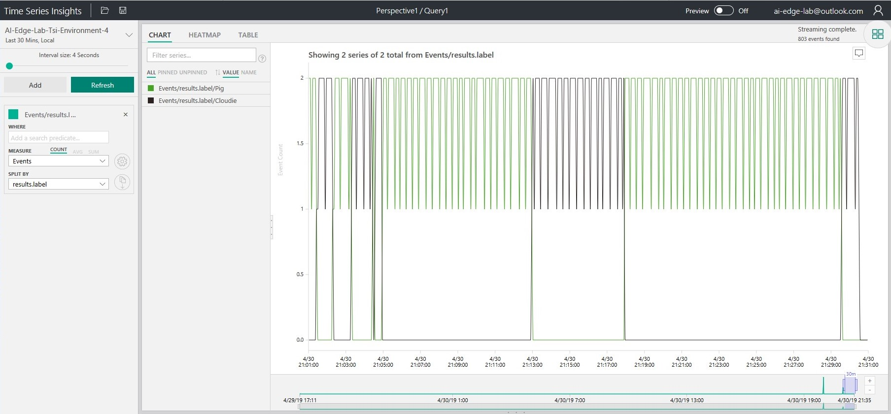

# Hands-On-Lab: Azure IoT Edge + AI on Windows IoT

For this lab, we will use the Azure Custom Vision service to train a machine learning model for image recognition. We will use that model to create a .NET application to pull frames from a connected USB camera, use Windows ML to classify the image, then send the result to Azure IoT Hub. We will deploy that application to a Windows IoT Core device using Azure IoT Edge. Finally, we will visualize the results using Time Series Insights.

# Pre-requisites Overview

Here's a recap of the configuration you'll need before you get started with the lab.

## Azure Services

We will need to set up a number of Azure services to complete this lab.

1. A valid Azure subscription. [Create an account](https://azure.microsoft.com/free/) for free.
1. [Azure Custom Vision Service](https://www.customvision.ai/)
1. [Azure Container Registry](https://docs.microsoft.com/en-us/azure/container-registry/)
1. [Azure IoT Hub](https://docs.microsoft.com/en-us/azure/iot-hub/), with a single device set up for Azure IoT Edge
1. [Azure Time Series Insights](https://docs.microsoft.com/en-us/azure/time-series-insights/), tied to the same Azure IoT Hub.

## Development Machine

To set up our Development Machine, we will need:

1. A PC running Windows 10 version 1809.
1. The [Windows SDK version 1809](https://developer.microsoft.com/en-us/windows/downloads/windows-10-sdk) (10.17763.0).
1. [.NET Core 2.2 SDK](https://dotnet.microsoft.com/download)
1. [Visual Studio Code](https://code.visualstudio.com/)
1. Azure IoT Hub Toolkit for Visual Studio Code
1. [Git for Windows](https://git-scm.com/download/win)
1. [Windows 10 IoT Core Dashboard](https://docs.microsoft.com/en-us/windows/iot-core/connect-your-device/iotdashboard)
1. Connected via Ethernet to a network switch on the same subnet as the Target Machine.

## Target Machine

In this lab, we are using an UP Squared board running IoT Core using CPU evaluation. With just a little change, this can also be done on an AMD V1000 running IoT Core with GPU evaluation, or soon on a Raspberry Pi. With a bit more change, it can also be run on a Windows PC running Windows 10 IoT Enterprise.

To recap, for this lab we are using:

1. [UP Squared](https://www.aaeon.com/en/p/iot-gateway-maker-boards-up-squared)
2. Running [Windows 10 IoT Core LTSC 2019](https://developer.microsoft.com/en-us/windows/iot)
3. With a USB camera
4. [Azure IoT Edge 1.0.6](https://docs.microsoft.com/en-us/azure/iot-edge/how-to-install-iot-edge-windows) or higher
5. Connected via Ethernet to a network switch on the same subnet as the Development PC.

## Physical Environment

1. Create a consistent environment for recognition. Use a single-color background. Place the objects in the same place, and the camera in the same place.
2. Select four or five physical objects you'll use for the classification.
3. Obtain a small desk lamp to illuminate them. Having consistent lighting helps the classifier.

# Pre-requisites in Detail

Here is more detail on how to set up your pre-requisites for the lab:

## Azure Custom Vision Service

Refer to this guide: [How to build a classifier with Custom Vision](https://docs.microsoft.com/en-us/azure/cognitive-services/Custom-Vision-Service/getting-started-build-a-classifier).

1. Sign into the Azure Portal
1. Create a new "Custom Vision" resource.
1. Sign into the [Custom Vision Portal](https://www.customvision.ai/) with the same account as your azure subscription
1. From the profile menu (upper-left) choose the "directory" associated with your azure subscription.

Your custom vision portal is all set!

## Azure Container Registry

Refer to this guide: [Quickstart: Create a private container registry using the Azure portal](https://docs.microsoft.com/en-us/azure/container-registry/container-registry-get-started-portal)

1. Sign into the Azure Portal
1. Create a new "Container Registry" resource
1. Once created, switch to the "Access Keys" pane.
1. Enable the "Admin User"
1. Make note of the Login Server, username, and password. You'll need these later.

## Azure IoT Hub

1. Sign into the Azure Portal
1. Create a new "IoT Hub" resource
1. Once created, switch to the "Shared access policies" pane, select the "iothubowner" policy.
1. Select the "Owner" role. 
1. Make note of the connection string for the iothubowner role. You'll need this later.
1. Now, we will create a device. Switch to the "IoT Edge" pane.
1. Choose "Add a new device"
1. Make a note of the name you chose for this device. You'll need this later.
1. Once created, select the device from the list.
1. Make note of the connection string for this device. You'll need this later.

## Azure Time Series Insights

Refer to this guide: [Add an IoT hub event source to your Time Series Insights environment](https://docs.microsoft.com/en-us/azure/time-series-insights/time-series-insights-how-to-add-an-event-source-iothub)

1. Sign into the Azure Portal
1. Create a new "Time Series Insights" resource.
1. Choose the "S1" pricing tier.
1. Choose "Next: Event Source"
1. For the event source, choose the existing Azure IoT Hub you configured above. For IoT Hub access policy, choose "iothubowner". For "consumer group", enter a unique name to use as the consumer group for events.

WARNING: The S1 pricing tier is $150/month. I recommend removing the time series insights from your account once you've run through the lab. The PAYG (pay-as-you-go) tier does not produce equivalent results in the Time Series Insights hub.

## Windows SDK

1. Download and install the 1809 version of the Windows SDK from the [Windows SDK Archive](https://developer.microsoft.com/en-us/windows/downloads/sdk-archive).
1. Determine the location of the Windows.winmd file. This is typically "C:\Program Files (x86)\Windows Kits\10\UnionMetadata\10.0.17763.0\Windows.winmd".
1. Set the "WINDOWS_WINMD" environment variable to this location.

```
PS C:\> $env:WINDOWS_WINMD = "C:\Program Files (x86)\Windows Kits\10\UnionMetadata\10.0.17763.0\Windows.winmd"
PS C:\> setx WINDOWS_WINMD "C:\Program Files (x86)\Windows Kits\10\UnionMetadata\10.0.17763.0\Windows.winmd"

SUCCESS: Specified value was saved.
```

## .NET Core SDK

1. Download and install the [.NET Core 2.2 SDK](https://dotnet.microsoft.com/download).

## Visual Studio Code

1. Download and install [Visual Studio Code](https://code.visualstudio.com/)
1. Download and install the [Azure IoT Hub Toolkit](https://marketplace.visualstudio.com/items?itemName=vsciot-vscode.azure-iot-toolkit) for Visual Studio Code
1. Connect VS Code to your IoT Hub as follows…
1. Return to the Explorer tab in VS Code
1. Hover over the "Azure IoT Hub Devices" pane.
1. Click the "…"
1. Choose "Set IoT Hub Connection String"
1. Enter the connection string for the IoT Hub Owner, from the steps above
1. You'll see the device show up which you created in the previous steps

## Windows IoT Core device

After setting up Windows IoT Core on the target device, we'll need to configure it to allow Power Shell connections.

Refer to this guide: [Using PowerShell for Windows IoT](https://docs.microsoft.com/en-us/windows/iot-core/connect-your-device/powershell)

1. Open an Windows PowerShell (Admin) window on the development PC
1. Replace the IP address in the example below with the correct IP address for the machine you're targeting

```
PS C:\WINDOWS\system32> net start WinRM
The requested service has already been started.
More help is available by typing NET HELPMSG 2182.

PS C:\WINDOWS\system32> $DeviceIPAddress = "192.168.1.102"
PS C:\WINDOWS\system32> Set-Item WSMan:\localhost\Client\TrustedHosts -Value $DeviceIPAddress
```

## Azure IoT Edge

1. Install Azure IoT Edge. Follow this guide: [Install the Azure IoT Edge runtime on Windows](https://docs.microsoft.com/en-us/azure/iot-edge/how-to-install-iot-edge-windows)
1. After installing Azure IoT Edge, deploy the [Simulated Temperature Sensor](https://docs.microsoft.com/en-us/azure/iot-edge/quickstart). 
1. In VS Code, open the "Azure IoT Hub Devices" pane. 
1. Look for the Edge Device Name there. 
1. Right-click on that device, then select "Start monitoring D2C message".
1. Look for simulated temperature sensor results in the output window.

## End-to-end setup verification

It's wise to check that the simulated temperature sensor data is flowing through to Time Series Insights.

1. Open the [Time Series Insights explorer](https://insights.timeseries.azure.com/) in a browser tab.
1. Choose the environment name you chose when creating the Time Series Insights resource in the portal.
1. Set "Quick Times" to "Last 30 minutes"
1. Click the "Auto On/Off" button until it reads "Auto On"
1. Press the search icon to update the data set
1. Set the Interval Size to 4 seconds (lowest possible)
1. In the "Events" section of the left panel, set "Measure" to "Count" of "Events", and "Split by" to "(None)"
1. Press the "Refresh" button to refresh data

This will show how many events are coming into Time Series Insights from the hub. This number should stay relatively consistent over time as more data comes in.

## Ready to go

When starting the lab, you should have these things open on your development machine:

1. These instructions
1. VS Code open to the C:\WindowsAiEdgeLabCV folder
1. [Custom Vision Portal](https://www.customvision.ai/) open in a browser tab, and logged in with your Azure Subscription. Select the Directory associated with your Azure custom vision resource. 
1. [Time Series Insights explorer](https://insights.timeseries.azure.com/) in another browser tab, also logged in
1. The following service and device information:

Item | Value
--- | ---
Azure Subscription Username	| 
Azure Subscription Password	| 
Container Registry Login Server	|
Container Registry Username	|
Container Registry Password	|
IoT Hub Name	|
IoT Hub Owner Connection String |
IoT Edge Device Name |	
IoT Edge Device Connection String |
Device Name |
Device IP Address |
Device Administrator Password |

# Step 1: Train the Model

1. Plug the USB camera into your development PC.
1. Using the Camera app on your development PC, take at least 5 pictures each of your objects. Store these pictures on your computer. Organize all the photos for each object into a folder named for this object. It will make them easier to upload.
1. Log into the [Custom Vision Portal](https://www.customvision.ai/)
1. Choose the Directory associated with your Azure account
1. Create a New Project. Be sure to choose a "compact" domain.
1. Upload them to your custom vision project. I recommend to upload one object at a time, so it's easy to apply a tag to all your images. Each time you upload all the images for a given object, specify the tag at that time.
1. Select "Train" to train the model
1. Select "Quick Test" to test the model.
1. Using the camera app on your PC, take one more picture of one of the objects
1. Upload the picture you took, verify that it was predicted correctly.
1. Export the model. From the "Performance" tab, select the "Export" command.
1. Choose "ONNX", then "ONNX1.2" version.
1. After downloading, rename the file "CustomVision.onnx"

# Step 2: Package the model into a C# .NET Application

## Get the code

If you are running this lab in an environment where this has already been set up, the initial sample will already be present in the directory C:\WindowsAiEdgeLabCV. Otherwise, clone the code as follows:

1. Open a Windows Powershell Prompt.
1. Change to a directory you'll use for the lab code. For example, C:\
1. Clone the lab repo https://github.com/jcoliz/WindowsAiEdgeLabCV.git

```
PS C:\> git clone https://github.com/jcoliz/WindowsAiEdgeLabCV.git 
Cloning into 'WindowsAiEdgeLabCV'...
remote: Azure Repos
remote: Found 78 objects to send. (51 ms)
Unpacking objects: 100% (78/78), done.
PS C:\> cd .\WindowsAiEdgeLabCV\
```

## Get your model file

Copy the CustomVision.onnx model file from your downloads directory where you exported it into the lab directory.

## Build & Test the sample

```
PS C:\WindowsAiEdgeLabCV> dotnet publish -r win-x64
Microsoft (R) Build Engine version 16.0.225-preview+g5ebeba52a1 for .NET Core
Copyright (C) Microsoft Corporation. All rights reserved.

  Restore completed in 43.29 ms for C:\WindowsAiEdgeLabCV\WindowsAiEdgeLabCV.csproj.
  WindowsAiEdgeLabCV -> C:\WindowsAiEdgeLabCV\bin\Debug\netcoreapp2.2\WindowsAiEdgeLabCV.dll
  WindowsAiEdgeLabCV -> C:\WindowsAiEdgeLabCV\bin\Debug\netcoreapp2.2\publish\
```

Run the sample to determine the name of the USB camera plugged in.

```
PS C:\WindowsAiEdgeLabCV> dotnet run --list
Found 1 Cameras
Microsoftr LifeCam HD-6000 for Notebooks
```

Point the camera at one of your objects, still connected to your development PC.

Run the sample locally to classify the object. This will test that the app is running correctly locally. For the 'device' parameter use a unique substring of the camera that came up. Here we can see that a "Mug" has been recognized.

```
PS C:\WindowsAiEdgeLabCV> dotnet run --model=CustomVision.onnx --device=LifeCam
4/24/2019 4:09:04 PM: Loading modelfile 'CustomVision.onnx' on the CPU...
4/24/2019 4:09:04 PM: ...OK 594 ticks
4/24/2019 4:09:05 PM: Running the model...
4/24/2019 4:09:05 PM: ...OK 47 ticks
4/24/2019 4:09:05 PM: Recognized {"results":[{"label":"Mug","confidence":1.0}],"metrics":{"evaltimeinms":47,"cycletimeinms":0}}
```

# Step 3: Build and push a moby container

## Connect to our IoT Core device

IoT Core container images must be built on an IoT Core device. 

We will need a way to copy files to our device, and a Windows PowerShell window from our development PC connected to that device.

First, we will map the Q: drive to our device so we can access files. You'll need the Device IP Address, as well as the Device Administrator Password.

```
PS C:\WindowsAiEdgeLabCV> $DeviceIPAddress = "192.168.1.102"
PS C:\WindowsAiEdgeLabCV> net use q: \\$DeviceIPAddress\c$ $DeviceAdministratorPassword /USER:Administrator
The command completed successfully.
```

Second, we'll connect a Windows PowerShell session to our target device. Open a new Windows PowerShell window, and connect to the device. When prompted enter the Device Administrator Password.

```
PS C:\WindowsAiEdgeLabCV> Enter-PSSession -ComputerName $DeviceIPAddress -Credential ~\Administrator
```

## Copy published files to target device

We will copy the 'publish' folder over to our device

```
PS C:\WindowsAiEdgeLabCV> robocopy .\bin\Debug\netcoreapp2.2\win-x64\publish\ q:\data\modules\customvision

-------------------------------------------------------------------------------
    ROBOCOPY     ::     Robust File Copy for Windows
-------------------------------------------------------------------------------

    Started : Wednesday, April 24, 2019 4:31:37 PM
    Source : D:\home\source\Repos\Windows-iotcore-samples\Samples\EdgeModules\SqueezeNetObjectDetection\cs\bin\Debug\netcoreapp2.2\win-x64\publish\
        Dest : q:\data\modules\customvision\

    Files : *.*

    Options : *.* /DCOPY:DA /COPY:DAT /R:1000000 /W:30

------------------------------------------------------------------------------
```

## Test the sample on the target device

Following the same approach as above, we will run the app on the target device to ensure we have the correct camera there, and it's working on that device.

1. Connect the camera to the IoT Core device.
1. In the Windows PowerShell window to the IoT Core device...
1. Change to the "c:\data\modules\customvision" directory
1. Do a test run as we did previously:

```
[192.168.1.102]: PS C:\Data\Users\Administrator\Documents> cd c:\data\modules\customvision

[192.168.1.102]: PS C:\data\modules\customvision> .\WindowsAiEdgeLabCV.exe --list
4/27/2019 8:30:52 AM: Available cameras:
4/27/2019 8:30:53 AM: Microsoft® LifeCam HD-6000 for Notebooks

[192.168.1.102]: PS C:\data\modules\customvision> .\WindowsAiEdgeLabCV.exe --model=CustomVision.onnx --device=LifeCam
4/27/2019 8:31:31 AM: Loading modelfile 'CustomVision.onnx' on the CPU...
4/27/2019 8:31:32 AM: ...OK 1516 ticks
4/27/2019 8:31:36 AM: Running the model...
4/27/2019 8:31:38 AM: ...OK 1953 ticks
4/27/2019 8:31:42 AM: Recognized {"results":[{"label":"Mug","confidence":1.0}],"metrics":{"evaltimeinms":1953,"cycletimeinms":0}}
```

## Containerize the sample app

Build the container on the device. To make things easier in this lab, we will set the value of $Container to the address where we will push our container. This will be in the container repository we set up earlier. Find the "Container Registry Login Server" address from the steps above. For example, I am using "aiedgelabcr.azurecr.io" 
to test the lab, so I will do as follows:

```
[192.168.1.102]: PS C:\data\modules\customvision> $Container = "aiedgelabcr.azurecr.io/customvision:1.0-x64-iotcore"
```

Still in the "c:\data\modules\customvision" directory, we will now build the container on the IoT Core device.
Note that if we were building for an IoT Enterprise device, we could just do this on our development machine.

```
[192.168.1.102]: PS C:\data\modules\customvision> docker build . -t $Container
Sending build context to Docker daemon  90.54MB

Step 1/5 : FROM mcr.microsoft.com/windows/iotcore:1809
 ---> b292a83fe7c1
Step 2/5 : ARG EXE_DIR=.
 ---> Using cache
 ---> cccdd52d4b4f
Step 3/5 : WORKDIR /app
 ---> Using cache
 ---> 3e071099a8a8
Step 4/5 : COPY $EXE_DIR/ ./
 ---> 951c8a6e96bc
Step 5/5 : CMD [ "WindowsAiEdgeLabCV.exe", "-mCustomVision.onnx", "-dLifeCam", "-ef" ]
 ---> Running in ae981c4d8819
Removing intermediate container ae981c4d8819
 ---> fee066f14f2c
Successfully built fee066f14f2c
Successfully tagged aiedgelabcr.azurecr.io/customvision:1.0-x64-iotcore
```

## Push the container

Now that we are sure the app is working correctly within the container, we will push it to our registry.

Before that, we will need to login to the container registry using the Container Registry Username and Container Registry Password obtained in previous steps.

```
PS C:\WindowsAiEdgeLabCV> docker login $ContainerRegistryLoginServer -u $ContainerRegistryUsername -p $ContainerRegistryPassword
Login Succeeded
```

Then we'll push the container into our registry.

```
[192.168.1.102]: PS C:\data\modules\customvision> docker push $Container
The push refers to repository [aiedgelabcr.azurecr.io/customvision]
c1933e4141d1: Preparing
ecdb3e0bf60d: Preparing
b7f45a54f179: Preparing
6bd44acbda1a: Preparing
13e7d127b442: Preparing
13e7d127b442: Skipped foreign layer
c1933e4141d1: Pushed
b7f45a54f179: Pushed
6bd44acbda1a: Pushed
ecdb3e0bf60d: Pushed
1.0-x64-iotcore: digest: sha256:7ba0ac77a29d504ce19ed2ccb2a2c67addb24533e4e3b66476ca018566b58086 size: 1465
```

# Step 4: Create an Azure IoT Edge deployment to the target device

## Author a deployment.json file

Now that we have a container with our inferencing logic safely up in our container registry, it's time to create an Azure IoT Edge deployment to our device.

We will do this back on the development PC.

Amongst the lab files, you will find a deployment json file named deployment.win-x64.json. Open this file in VS Code. We must fill in the details for the container image we just built above, along with our container registry credentials.

Search for "{ACR_*}" and replace those values with the correct values for your container repository.
The ACR_IMAGE must exactly match what you pushed, e.g. aiedgelabcr.azurecr.io/customvision:1.0-x64-iotcore

```
    "$edgeAgent": {
      "properties.desired": {
        "runtime": {
          "settings": {
            "registryCredentials": {
              "{ACR_NAME}": {
                "username": "{ACR_USER}",
                "password": "{ACR_PASSWORD}",
                "address": "{ACR_NAME}.azurecr.io"
              }
            }
          }
        }
...
        "modules": {
            "squeezenet": {
            "settings": {
              "image": "{ACR_IMAGE}",
              "createOptions": "{\"HostConfig\":{\"Devices\":[{\"CgroupPermissions\":\"\",\"PathInContainer\":\"\",\"PathOnHost\":\"class/E5323777-F976-4f5b-9B55-B94699C46E44\"},{\"CgroupPermissions\":\"\",\"PathInContainer\":\"\",\"PathOnHost\":\"class/5B45201D-F2F2-4F3B-85BB-30FF1F953599\"}],\"Isolation\":\"Process\"}}"
            }
          }
```

## Deploy edge modules to device

Refer to this guide: [Deploy Azure IoT Edge modules from Visual Studio Code](https://docs.microsoft.com/en-us/azure/iot-edge/how-to-deploy-modules-vscode)

1. In VS Code, open the "Azure IoT Hub Devices" pane. 
1. Locate the device there named according to the edge device name from when you created it in the hub. 
1. Right-click on that device, then select "Create deployment for single device".
1. Choose the deployment.json file you edited in the step above.
1. Press OK
1. Look for "deployment succeeded" in the output window.

```
[Edge] Start deployment to device [ai-edge-lab-device]
[Edge] Deployment succeeded.
```

## Verify the deployment on device

Wait a few minutes for the deployment to go through. On the target device you can inspect the running modules. Success looks like this:

```
[192.168.1.102]: PS C:\data\modules\customvision> iotedge list
NAME             STATUS           DESCRIPTION      CONFIG
customvision     running          Up 32 seconds    aiedgelabcr.azurecr.io/customvision:1.0-x64-iotcore
edgeAgent        running          Up 2 minutes     mcr.microsoft.com/azureiotedge-agent:1.0
edgeHub          running          Up 1 second      mcr.microsoft.com/azureiotedge-hub:1.0
```

Once the modules are up, you can inspect that the "customvision" module is operating correctly:

```
[192.168.1.102]: PS C:\data\modules\customvision> iotedge logs customvision
4/27/2019 9:04:59 AM: WindowsAiEdgeLabCV module starting.
4/27/2019 9:04:59 AM: Initializing Azure IoT Edge...
4/27/2019 9:06:11 AM: IoT Hub module client initialized.
4/27/2019 9:06:11 AM: ...OK 71516 ticks
4/27/2019 9:06:11 AM: Loading modelfile 'CustomVision.onnx' on the CPU...
4/27/2019 9:06:15 AM: ...OK 4140 ticks
4/27/2019 9:06:25 AM: Running the model...
4/27/2019 9:06:27 AM: ...OK 1500 ticks
4/27/2019 9:06:27 AM: Recognized {"results":[{"label":"Mug","confidence":1.0}],"metrics":{"evaltimeinms":1500,"cycletimeinms":0}}
```

Finally, beck on the development machine, we can monitor device to cloud (D2C) messages from VS Code to ensure the messages are going up.

1. In VS Code, open the "Azure IoT Hub Devices" pane. 
1. Locate the device there named "ai-edge-lab-device". 
1. Right-click on that device, then select "Start monitoring D2C message".
1. Look for inferencing results in the output window.

```
[IoTHubMonitor] [9:07:44 AM] Message received from [ai-edge-lab-device/customvision]:
{
  "results": [
    {
      "label": "Mug",
      "confidence": 1
    }
  ],
  "metrics": {
    "evaltimeinms": 1484,
    "cycletimeinms": 0
  }
}
```

Once you see this, you can be certain the inferencing is happening on the target device and flowing up to the Azure IoT Hub.

# Step 5: View the results in Time Series Insights

1. Open the [Time Series Insights explorer](https://insights.timeseries.azure.com/) in a browser tab.
1. Choose the environment name you chose when creating the Time Series Insights resource in the portal.
1. Set "Quick Times" to "Last 30 minutes"
1. Click the "Auto On/Off" button until it reads "Auto On"
1. Press the search icon to update the data set
1. Set the Interval Size to 4 seconds (lowest possible)
1. In the "Events" section of the left panel, set "Measure" to "Count" of "Events", and "Split by" to "results.label"
1. Press the "Refresh" button to refresh data

Now you can change the object in front of the camera, and wait 10 seconds or so for the data to propagate, then press "Refresh" again. 
You'll see the graph change to indicate more of the new object at the current time.


