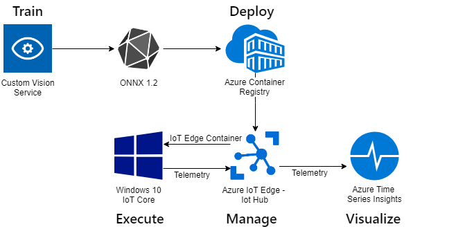

# Hands-On-Lab: Azure IoT Edge + AI on Windows IoT

For this lab, we will use [Azure Cognitive Services](https://azure.microsoft.com/en-us/services/cognitive-services/) - [Custom Vision](https://customvision.ai) to train a machine learning model for image classification. 

We will download the ONNX model from Custom Vision, add some .NET components and deploy the model in a docker container to a device running [Azure IoT Edge](https://azure.microsoft.com/en-us/services/iot-edge/) on [Windows 10 IoT Core](https://www.microsoft.com/en-us/windowsforbusiness/windows-iot).

Images will be captured from a camera on our edge device with inferencing happening at the edge using [Windows ML](https://docs.microsoft.com/en-us/windows/ai/windows-ml/) and sending our results through [Azure IoT Hub](https://azure.microsoft.com/en-us/services/iot-hub/). Finally, we will visualize the results using [Azure Time Series Insights](https://azure.microsoft.com/en-us/services/time-series-insights/).



# Pre-requisites Overview

Here's a recap of the configuration you'll need before you get started with the lab.

## Azure Services

We will need to set up a number of Azure services to complete this lab.

1. A valid Azure subscription. [Create an account](https://azure.microsoft.com/free/) for free.
1. [Azure Custom Vision Service](https://www.customvision.ai/)
1. [Azure Container Registry](https://docs.microsoft.com/en-us/azure/container-registry/)
1. [Azure IoT Hub](https://docs.microsoft.com/en-us/azure/iot-hub/), with a single device set up for Azure IoT Edge
1. [Azure Time Series Insights](https://docs.microsoft.com/en-us/azure/time-series-insights/), tied to the same Azure IoT Hub.

## Development Machine

To set up our Development Machine, we will need:

1. A PC running Windows 10 version 1809.
1. The [Windows SDK version 1809](https://developer.microsoft.com/en-us/windows/downloads/windows-10-sdk) (10.17763.0).
1. [.NET Core 2.2 SDK](https://dotnet.microsoft.com/download)
1. [Visual Studio Code](https://code.visualstudio.com/)
1. Azure IoT Hub Toolkit for Visual Studio Code
1. [Git for Windows](https://git-scm.com/download/win)
1. [Windows 10 IoT Core Dashboard](https://docs.microsoft.com/en-us/windows/iot-core/connect-your-device/iotdashboard)
1. Connected via Ethernet to a network switch on the same subnet as the Target Machine.

## Target Machine

In this lab, we are using an UP Squared board running IoT Core using CPU evaluation. With just a little change, this can also be done on an AMD V1000 running IoT Core with GPU evaluation, or soon on a Raspberry Pi. With a bit more change, it can also be run on a Windows PC running Windows 10 IoT Enterprise.

To recap, for this lab we are using:

1. [AAEON UP Squared](https://docs.microsoft.com/en-us/windows/iot-core/tutorials/quickstarter/prototypeboards) board
2. Running [Windows 10 IoT Core LTSC 2019](https://developer.microsoft.com/en-us/windows/iot)
3. With a USB camera
4. [Azure IoT Edge 1.0.6](https://docs.microsoft.com/en-us/azure/iot-edge/how-to-install-iot-edge-windows) or higher
5. Connected via Ethernet to a network switch on the same subnet as the Development PC.

## Physical Environment

1. Create a consistent environment for recognition. Use a single-color background. Place the objects in the same place, and the camera in the same place.
2. Select four or five physical objects you'll use for the classification.
3. Obtain a small desk lamp to illuminate them. Having consistent lighting helps the classifier.

# Pre-requisites in Detail

Here is more detail on how to set up your pre-requisites for the lab:

## Azure Custom Vision Service

Refer to this guide: [How to build a classifier with Custom Vision](https://docs.microsoft.com/en-us/azure/cognitive-services/Custom-Vision-Service/getting-started-build-a-classifier).

1. Sign into the Azure Portal
1. Create a new "Custom Vision" resource.
1. Sign into the [Custom Vision Portal](https://www.customvision.ai/) with the same account as your azure subscription
1. From the profile menu (upper-right) choose the "directory" associated with your azure subscription.

Your custom vision portal is all set!

## Azure Container Registry

Refer to this guide: [Quickstart: Create a private container registry using the Azure portal](https://docs.microsoft.com/en-us/azure/container-registry/container-registry-get-started-portal)

1. Sign into the Azure Portal
1. Create a new "Container Registry" resource
1. Once created, switch to the "Access Keys" pane.
1. Enable the "Admin User"
1. Make note of the Login Server, username, and password. You'll need these later.

## Azure IoT Hub

1. Sign into the Azure Portal
1. Create a new "IoT Hub" resource
1. Once created, switch to the "Shared access policies" pane, select the "iothubowner" policy.
1. Select the "Owner" role. 
1. Make note of the connection string for the iothubowner role. You'll need this later.
1. Now, we will create a device. Switch to the "IoT Edge" pane.
1. Choose "Add a new device"
1. Make a note of the name you chose for this device. You'll need this later.
1. Once created, select the device from the list.
1. Make note of the connection string for this device. You'll need this later.

## Azure Time Series Insights

Refer to this guide: [Add an IoT hub event source to your Time Series Insights environment](https://docs.microsoft.com/en-us/azure/time-series-insights/time-series-insights-how-to-add-an-event-source-iothub)

1. Sign into the Azure Portal
1. Create a new "Time Series Insights" resource.
1. Choose the "S1" pricing tier.
1. Choose "Next: Event Source"
1. For the event source, choose the existing Azure IoT Hub you configured above. For IoT Hub access policy, choose "iothubowner". For "consumer group", enter a unique name to use as the consumer group for events.

WARNING: The S1 pricing tier is $150/month. I recommend removing the time series insights from your account once you've run through the lab. The PAYG (pay-as-you-go) tier does not produce equivalent results in the Time Series Insights hub.

## Windows SDK

1. Download and install the 1809 version of the Windows SDK from the [Windows SDK Archive](https://developer.microsoft.com/en-us/windows/downloads/sdk-archive).
1. Determine the location of the Windows.winmd file. This is typically "C:\Program Files (x86)\Windows Kits\10\UnionMetadata\10.0.17763.0\Windows.winmd".
1. Set the "WINDOWS_WINMD" environment variable to this location.

```
PS C:\> $env:WINDOWS_WINMD = "C:\Program Files (x86)\Windows Kits\10\UnionMetadata\10.0.17763.0\Windows.winmd"
PS C:\> setx WINDOWS_WINMD "C:\Program Files (x86)\Windows Kits\10\UnionMetadata\10.0.17763.0\Windows.winmd"

SUCCESS: Specified value was saved.
```

## .NET Core SDK

1. Download and install the [.NET Core 2.2 SDK](https://dotnet.microsoft.com/download).

## Visual Studio Code

1. Download and install [Visual Studio Code](https://code.visualstudio.com/)
1. Download and install the [Azure IoT Hub Toolkit](https://marketplace.visualstudio.com/items?itemName=vsciot-vscode.azure-iot-toolkit) for Visual Studio Code
1. Connect VS Code to your IoT Hub as follows…
1. Return to the Explorer tab in VS Code
1. Hover over the "Azure IoT Hub Devices" pane.
1. Click the "…"
1. Choose "Set IoT Hub Connection String"
1. Enter the connection string for the IoT Hub Owner, from the steps above
1. You'll see the device show up which you created in the previous steps

## Windows IoT Core device

After setting up Windows IoT Core on the target device, we'll need to configure it to allow Power Shell connections.

Refer to this guide: [Using PowerShell for Windows IoT](https://docs.microsoft.com/en-us/windows/iot-core/connect-your-device/powershell)

1. Open an Windows PowerShell (Admin) window on the development PC
1. Replace the IP address in the example below with the correct IP address for the machine you're targeting

```
PS C:\WINDOWS\system32> net start WinRM
The requested service has already been started.
More help is available by typing NET HELPMSG 2182.

PS C:\WINDOWS\system32> $DeviceIPAddress = "192.168.1.102"
PS C:\WINDOWS\system32> Set-Item WSMan:\localhost\Client\TrustedHosts -Value $DeviceIPAddress
```

## Azure IoT Edge

1. Install Azure IoT Edge. Follow this guide: [Install the Azure IoT Edge runtime on Windows](https://docs.microsoft.com/en-us/azure/iot-edge/how-to-install-iot-edge-windows)
1. After installing Azure IoT Edge, deploy the [Simulated Temperature Sensor](https://docs.microsoft.com/en-us/azure/iot-edge/quickstart). 
1. In VS Code, open the "Azure IoT Hub Devices" pane. 
1. Look for the Edge Device Name there. 
1. Expand "Modules". Notice three modules there, all green and connected.
1. Right-click on that device, then select "Start monitoring D2C message".
1. Look for simulated temperature sensor results in the output window.

## End-to-end setup verification

It's wise to check that the simulated temperature sensor data is flowing through to Time Series Insights.

1. Open the [Time Series Insights explorer](https://insights.timeseries.azure.com/) in a browser tab.
1. Choose the environment name you chose when creating the Time Series Insights resource in the portal.
1. Set "Quick Times" to "Last 30 minutes"
1. Click the "Auto On/Off" button until it reads "Auto On"
1. Press the search icon to update the data set
1. Set the Interval Size to 4 seconds (lowest possible)
1. In the "Events" section of the left panel, set "Measure" to "Count" of "Events", and "Split by" to "(None)"
1. Press the "Refresh" button to refresh data

This will show how many events are coming into Time Series Insights from the hub. This number should stay relatively consistent over time as more data comes in.

## Ready to go

When starting the lab, you should have these things open on your development machine:

1. These instructions
1. VS Code open
1. [Custom Vision Portal](https://www.customvision.ai/) open in a browser tab, and logged in with your Azure Subscription. Select the Directory associated with your Azure custom vision resource. 
1. [Time Series Insights explorer](https://insights.timeseries.azure.com/) in another browser tab, also logged in
1. The following service and device information:

Item | Value
--- | ---
Azure Subscription Username	| 
Azure Subscription Password	| 
Container Registry Login Server	|
Container Registry Username	|
Container Registry Password	|
IoT Hub Name	|
IoT Hub Owner Connection String |
IoT Edge Device Name |	
IoT Edge Device Connection String |
Device Name |
Device IP Address |
Device Administrator Password |

# Step 1 - Train the Model

## 1.1 - Gather Training Images
1. Plug the USB camera into your lab PC
1. Open the Windows Camera app from the Start Menu
1. Take between 10-15 photos of each object you'd like to recognize with your model. **NOTE: More photos with different rotations and focal length should theoretically make for a better model!**
1. Confirm your photos are in the ```Pictures > Camera Roll``` folder

## 1.2 - Create a Custom Vision Service Project
1. Log into the [Custom Vision Service portal](https://www.customvision.ai/) using the provided Azure credentials (found in the credentials.txt file - see above)
1. Choose the Directory associated with your Azure account
1. Click 'New Project'
1. Enter the following values and click 'Create Project'

|Name                 |Value                |
|---------------------|---------------------|
|Project Name         |[your choice]        |
|Project Types        |Classification       |
|Classification Types |Multiclass           |
|Domains              |General **(compact)**|

NOTE: Requires putting credentials into credentials.txt

## 1.3 - Import Images into Custom Vision Service
1. Click the 'Add Images' button and browse to the ```Pictures > Camera Roll``` directory
1. Select the 10-15 image set for each a object type
1. Enter a tag name - this is what your model will predict when it sees this object
1. Repeat this until each set of images is uploaded into Custom Vision

## 1.4 - Train and test your model
1. Click the green 'Train' button in the top right corner. After your model has trained, you can see the rated performance
1. Click 'Quick Test' next to the 'Train' button and upload an extra image of your item that **was not** included in the original 10-15 images

## 1.5 - Export ONNX model
1. Return to the Performance tab
1. Click the 'Export' to start the download process
1. Select ONNX as the model format and ONNX 1.2 as the format version
1. Click 'Download' and rename to CustomVision.onnx in the ```Downloads``` folder

# Step 2 - Package the model into a C# .NET Application

NOTE: Requires pulling the code as part of setup

## 2.1 - Find the code

1. Open a Windows PowerShell Prompt **as Administrator**
1. Type the following to prepare your environment:
```powershell
cd c:\Users\Admin\Desktop\WindowsIoT\WindowsAiEdgeLabCV
git clean -xdf
git reset --hard
git pull
```

## 2.2 - Prepare your model file
1. Copy your CustomVision.onnx to ```c:\Users\Admin\Desktop\WindowsIoT\WindowsAiEdgeLabCV``` either through Explorer, or with the following command: 

```powershell
copy c:\Users\Admin\Downloads\CustomVision.onnx .\
```

## 2.3 - Build and test the code
1. Run the following code:

```powershell
dotnet restore -r win-x64
dotnet publish -r win-x64
```
2. Point the camera at one of your objects and test by running the following:

```powershell
dotnet run --model=CustomVision.onnx --device=LifeCam
```

If the model is successful, you will see a prediction label show in the console.

NOTE: This requires the LifeCam camera

# Step 3 - Build and push a container

## 3.1 - Connect to IoT Core device

In this lab, we will build and push the container from the IoT Core device. 

We will need a way to copy files to our device and a Windows PowerShell window from our development PC connected to that device.

First, we will map the Q: drive to our device so we can access files. 

You'll need the Device IP Address. To get the IP Address open the "IoT Dashboard" from the desktop of your surface and select "My Devices".
 
The name of your device is written on the underside of the IoT device case in white ink.

Right click on your device and select "Copy IPv4 Address".

Run the following commands in your PowerShell terminal:

```powershell
$ip = "ENTER YOUR DEVICE IP ADDRESS HERE"
net use q: \\$ip\c$ "p@ssw0rd" /USER:Administrator
```

NOTE: Requires IP address on the underside of the device!!


## 3.2 - Copy binaries to IoT device

We will copy the 'publish' folder over to our device

```powershell
cd "C:\Users\Admin\Desktop\WindowsIoT\WindowsAiEdgeLabCV"
robocopy .\bin\Debug\netcoreapp2.2\win-x64\publish\ q:\data\modules\customvision
```

## 3.3 - Test the binaries on IoT device

Next we will run the binaries on the target device.

1. Connect the camera to the IoT Core device
1. Establish a remote PowerShell session on the IoT Core device by opening ``` Start Menu > IoT Dashboard```, right clicking on your device and clicking on 'Launch PowerShell'


To test the binaries, run the following commands in the remote PowerShell session:

```powershell
cd "C:\data\modules\customvision"
.\WindowsAiEdgeLabCV.exe --model=CustomVision.onnx --device=LifeCam
```

If the test is successful, you should see objects recognized in the console.

```
4/27/2019 8:31:31 AM: Loading modelfile 'CustomVision.onnx' on the CPU...
4/27/2019 8:31:32 AM: ...OK 1516 ticks
4/27/2019 8:31:36 AM: Running the model...
4/27/2019 8:31:38 AM: ...OK 1953 ticks
4/27/2019 8:31:42 AM: Recognized {"results":[{"label":"Mug","confidence":1.0}],"metrics":{"evaltimeinms":1953,"cycletimeinms":0}}
```

## 3.5 - Containerize the sample app

**NOTE: The 'Container' related credentials (see above) will be useful in these steps.**

```powershell
#EXAMPLE: aiedgelabcr.azurecr.io/customvision:1.0-x64-iotcore
$container = "ENTER YOUR CONTAINER NAME HERE"
docker build . -t $container
```

## 3.6 - Authenticate and push to Azure Container Registry

1. Authenticate to the Azure Container Registry

```powershell
docker login "ENTER YOUR CONTAINER REGISTRY NAME/URL" -u "ENTER YOUR CONTAINER REGISTRY USERNAME" -p "ENTER YOUR CONTAINER REGISTRY PASSWORD"
docker push $container
```

# Step 4 - Create an Azure IoT Edge deployment to the target device

## Author a deployment.json file

Now that we have a container with our inferencing logic safely up in our container registry, it's time to create an Azure IoT Edge deployment to our device.

We will do this back on the development PC.

Amongst the lab files, you will find a deployment json file named deployment.win-x64.json. Open this file in VS Code. We must fill in the details for the container image we just built above, along with our container registry credentials.

Search for "{ACR_*}" and replace those values with the correct values for your container repository.
The ACR_IMAGE must exactly match what you pushed, e.g. aiedgelabcr.azurecr.io/customvision:1.0-x64-iotcore

```
    "$edgeAgent": {
      "properties.desired": {
        "runtime": {
          "settings": {
            "registryCredentials": {
              "{ACR_NAME}": {
                "username": "{ACR_USER}",
                "password": "{ACR_PASSWORD}",
                "address": "{ACR_NAME}.azurecr.io"
              }
            }
          }
        }
...
        "modules": {
            "squeezenet": {
            "settings": {
              "image": "{ACR_IMAGE}",
              "createOptions": "{\"HostConfig\":{\"Devices\":[{\"CgroupPermissions\":\"\",\"PathInContainer\":\"\",\"PathOnHost\":\"class/E5323777-F976-4f5b-9B55-B94699C46E44\"},{\"CgroupPermissions\":\"\",\"PathInContainer\":\"\",\"PathOnHost\":\"class/5B45201D-F2F2-4F3B-85BB-30FF1F953599\"}],\"Isolation\":\"Process\"}}"
            }
          }
```

NOTE: This section is removed from aware group version.

## 4.1 - Deploy edge modules to device

Refer to this guide for more information: [Deploy Azure IoT Edge modules from Visual Studio Code](https://docs.microsoft.com/en-us/azure/iot-edge/how-to-deploy-modules-vscode)

1. In Visual Studio Code, open the 'Azure IoT Hub Devices' pane by selecting the Explorer sidebar in the top left corner (Ctrl + Shift + E) and then clicking on the 'Azure IoT Hub Devices' at the bottom of the sidebar when it opens
1. If you see '-> Select IoT Hub', you will need to log in with your Azure Subscription, select the 'MS IoT Labs - Windows IoT' subscription and the IoT Hub
1. Right-click on your device (for example, 'A09') and click 'Create Deployment for Single Device'
1. Select ```C:\Users\Admin\Desktop\WindowsIoT\deployment.json```
1. Look for "deployment succeeded" in the output window.

## 4.2 - Verify the deployment on IoT device

The module deployment is instant, however changes to the device can take around 5-7 minutes to take effect. On the **target device** you can inspect the running modules with the following command in the remote PowerShell terminal:

```powershell
iotedge list
```

You will see the Agent, Hub and our Custom Vision models deployed:

```
NAME             STATUS           DESCRIPTION      CONFIG
customvision     running          Up 32 seconds    aiedgelabcr.azurecr.io/customvision:1.0-x64-iotcore
edgeAgent        running          Up 2 minutes     mcr.microsoft.com/azureiotedge-agent:1.0
edgeHub          running          Up 1 second      mcr.microsoft.com/azureiotedge-hub:1.0
```

Once the modules have deployed to your device, you can inspect that the "customvision" module is operating correctly:

```powershell
iotedge logs customvision
```

You will see the familiar module logs we saw earlier when testing:

```
4/27/2019 9:04:59 AM: WindowsAiEdgeLabCV module starting.
4/27/2019 9:04:59 AM: Initializing Azure IoT Edge...
4/27/2019 9:06:11 AM: IoT Hub module client initialized.
4/27/2019 9:06:11 AM: ...OK 71516 ticks
4/27/2019 9:06:11 AM: Loading modelfile 'CustomVision.onnx' on the CPU...
4/27/2019 9:06:15 AM: ...OK 4140 ticks
4/27/2019 9:06:25 AM: Running the model...
4/27/2019 9:06:27 AM: ...OK 1500 ticks
4/27/2019 9:06:27 AM: Recognized {"results":[{"label":"Mug","confidence":1.0}],"metrics":{"evaltimeinms":1500,"cycletimeinms":0}}
```

## 4.3 - Monitor Device to Cloud messages

1. In Visual Studio Code, open the 'Azure IoT Hub Devices' pane  
1. Right-click your device and 'Start monitoring D2C messages'
1. Test your model by holding up objects in front of the camera

You will see inferencing results in the output window:

```
[IoTHubMonitor] [9:07:44 AM] Message received from [ai-edge-lab-device/customvision]:
{
  "results": [
    {
      "label": "Mug",
      "confidence": 1
    }
  ],
  "metrics": {
    "evaltimeinms": 1484,
    "cycletimeinms": 0
  }
}
```

Once you see this, you can be certain the inferencing is happening on the target device and flowing up to the Azure IoT Hub.

# Step 5 - View the results in Time Series Insights

1. Open the [Time Series Insights explorer](https://insights.timeseries.azure.com/) in a browser tab.
1. Choose the environment name you chose when creating the Time Series Insights resource in the portal.
1. Set "Quick Times" to "Last 30 minutes"
1. Click the "Auto On/Off" button until it reads "Auto On"
1. Press the search icon to update the data set
1. Set the Interval Size to 4 seconds (lowest possible)
1. In the "Events" section of the left panel, set "Measure" to "Count" of "Events", and "Split by" to "results.label"
1. Press the "Refresh" button to refresh data

Now you can change the object in front of the camera, and wait 10 seconds or so for the data to propagate, then press "Refresh" again. 
You'll see the graph change to indicate more of the new object at the current time.


**Thanks for participating in the lab!**
